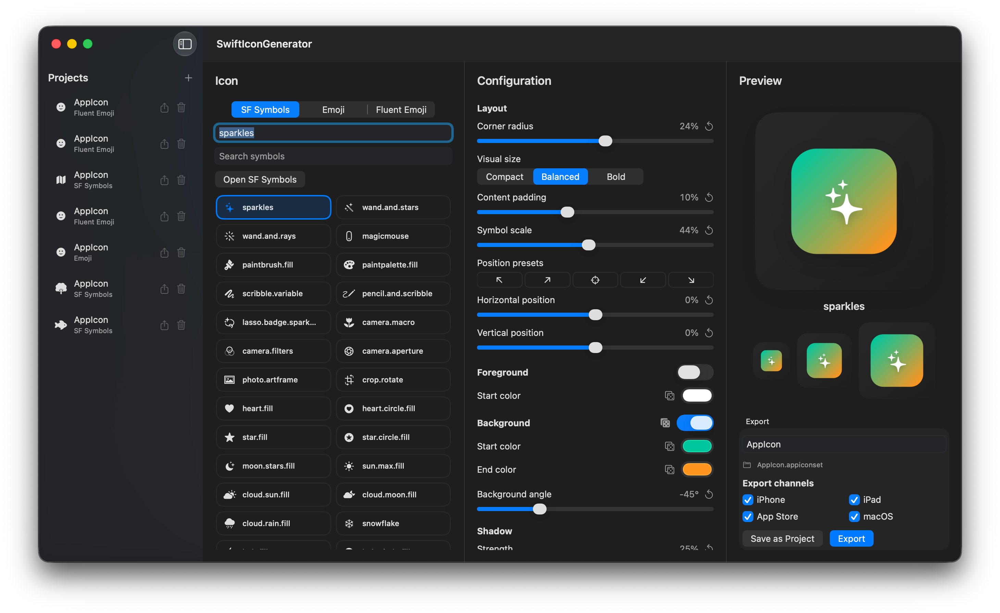

# SwiftIconGenerator

> This project was built through vibe coding with GPT-5.4 / GPT-5.5 in OpenCode.

[中文说明 / Chinese README](./README.zh-CN.md)

## Preview



SwiftIconGenerator is a macOS SwiftUI app for generating Xcode-ready app icon sets from `SF Symbols`, `Emoji`, or locally indexed `Fluent Emoji` assets.

It is designed for quickly creating polished `AppIcon.appiconset` assets that can be dropped directly into `Assets.xcassets`.

## Features

- Generate icons from `SF Symbols`, `Emoji`, and `Fluent Emoji`
- Search and pick from a built-in SF Symbols list
- Open the SF Symbols app directly from the source panel
- Pick from a built-in emoji list or open the macOS system emoji picker
- Index a local Fluent Emoji repository and browse assets with quick alphabet navigation
- Choose Fluent Emoji styles: `3D`, `Color`, `Flat`, and `High Contrast`
- Randomly pick a Fluent Emoji from the current search or letter filter
- Tint High Contrast Fluent Emoji with the foreground color or foreground gradient
- Live preview at multiple icon sizes with an optional contrast background
- Tune appearance with:
  - foreground color
  - foreground gradient and angle
  - background color
  - background gradient and angle
  - corner radius
  - content padding
  - symbol scale
  - horizontal and vertical content position
  - shadow strength and angle
- Visual size presets: `Compact`, `Balanced`, `Bold`
- Compact one-row position presets for quick corner and center placement
- Save and reload projects from the sidebar
- Import and export app data or individual project files
- Manage app settings for theme, language, preview background, data, Fluent Emoji indexing, and About links
- Export a named `.appiconset`
- Filter export targets by platform:
  - iPhone
  - iPad
  - App Store
  - macOS

## Export Output

The app exports a complete Xcode-compatible `AppIcon.appiconset` including `Contents.json`.

Example output files:

- `appicon-iphone-60@2x.png`
- `appicon-iphone-60@3x.png`
- `appicon-ipad-76@1x.png`
- `appicon-ipad-76@2x.png`
- `appicon-ipad-83.5@2x.png`
- `appicon-appstore-1024.png`
- `appicon-mac-16@1x.png`
- `appicon-mac-16@2x.png`
- `appicon-mac-32@1x.png`
- `appicon-mac-32@2x.png`
- `appicon-mac-128@1x.png`
- `appicon-mac-128@2x.png`
- `appicon-mac-256@1x.png`
- `appicon-mac-256@2x.png`
- `appicon-mac-512@1x.png`
- `appicon-mac-512@2x.png`
- `Contents.json`

Drop the generated `.appiconset` folder into your Xcode project's `Assets.xcassets`.

## Run

Recommended:

1. Open `SwiftIconGenerator.xcodeproj`
2. Run the `SwiftIconGenerator` scheme in Xcode

The project is configured as a standard macOS app project and includes a proper app icon.

You can also run it from the command line:

```bash
swift run
```

## Usage

1. Choose `SF Symbols`, `Emoji`, or `Fluent Emoji`
2. Select or enter your icon content
3. Adjust appearance settings
4. Save the project if you want to reuse it later
5. Choose the icon set name
6. Select export platforms
7. Export the `.appiconset`

## Fluent Emoji

Fluent Emoji support is based on a local Fluent Emoji repository folder. Open Settings, choose the repository folder, then run `Detect and Index`. Once indexed, Fluent Emoji appears as an icon source with style selection and searchable asset browsing.

The High Contrast style is treated as a template image, so it can be tinted with the selected foreground color or foreground gradient.

## Settings

Settings are available from the app menu or `Command + ,`.

- Theme: system, light, or dark
- Language: system, English, or Simplified Chinese
- Preview contrast background: enabled by default for checking transparent icon edges
- Fluent Emoji folder detection, indexing, and clearing
- Data import, export, and reset
- Version, repository, and license links

## Project Layout

- `SwiftIconGenerator.xcodeproj`: standard macOS Xcode project
- `SwiftIconGenerator/`: app resources such as `Info.plist` and `Assets.xcassets`
- `Sources/`: SwiftUI app source code and icon rendering logic
- `Package.swift`: Swift Package definition for command-line builds

## Notes

- The Xcode project is the primary way to run the app.
- The Swift Package remains available for quick builds and local iteration.
- Emoji rendering uses text drawing, while SF Symbols rendering uses AppKit symbol images.
- Fluent Emoji images are cached after first load to keep picker browsing and preview updates responsive.
- Version display is read from the app bundle. Xcode builds use `MARKETING_VERSION` and `CURRENT_PROJECT_VERSION`; SwiftPM builds fall back to a development label.

## License

This project is licensed under the MIT License. See [`LICENSE`](./LICENSE).
