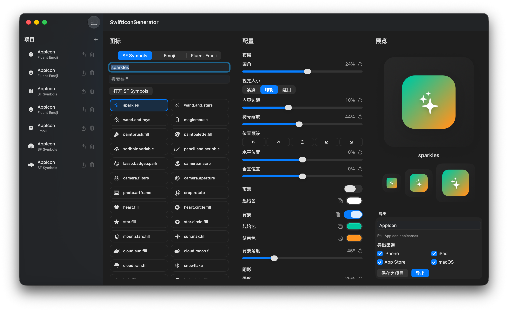

# SwiftIconGenerator

> 本项目通过 OpenCode 中的 GPT-5.4 / GPT-5.5 以 Vibe Coding 方式构建。

[English README](./README.md)

## 预览



SwiftIconGenerator 是一个基于 macOS SwiftUI 的图标生成工具，可以将 `SF Symbols`、`Emoji` 或本地索引的 `Fluent Emoji` 资源生成为可直接用于 Xcode 的 `AppIcon.appiconset`。

它适合快速生成风格统一、可直接拖入 `Assets.xcassets` 的应用图标资源。

## 功能

- 支持使用 `SF Symbols`、`Emoji` 和 `Fluent Emoji` 生成图标
- 内置可搜索的 SF Symbols 列表
- 可从来源面板直接打开 SF Symbols 应用
- 内置常用 emoji 快速选择，也支持打开 macOS 系统 Emoji 选择器
- 支持索引本地 Fluent Emoji 仓库，并通过字母索引快速浏览资源
- 支持 Fluent Emoji 风格：`3D`、`Color`、`Flat`、`High Contrast`
- 支持在当前搜索结果或字母筛选范围内随机选择 Fluent Emoji
- High Contrast Fluent Emoji 可使用前景色或前景渐变染色
- 支持多尺寸实时预览，并可开启预览对比背景
- 可调整以下外观参数：
  - 前景色
  - 前景渐变和角度
  - 背景色
  - 背景渐变和角度
  - 圆角
  - 内容留白
  - 图标缩放
  - 水平和垂直位置
  - 阴影强度和角度
- 提供视觉大小预设：`Compact`、`Balanced`、`Bold`
- 提供紧凑的单行位置预设，可快速放到四角或居中
- 支持在侧边栏保存和重新加载项目
- 支持导入、导出应用数据或单个项目文件
- 设置页可管理主题、语言、预览背景、数据、Fluent Emoji 索引和关于信息
- 支持自定义导出的 `.appiconset` 名称
- 支持按平台筛选导出：
  - iPhone
  - iPad
  - App Store
  - macOS

## 导出结果

应用会导出完整的、兼容 Xcode 的 `AppIcon.appiconset`，并自动生成 `Contents.json`。

示例文件：

- `appicon-iphone-60@2x.png`
- `appicon-iphone-60@3x.png`
- `appicon-ipad-76@1x.png`
- `appicon-ipad-76@2x.png`
- `appicon-ipad-83.5@2x.png`
- `appicon-appstore-1024.png`
- `appicon-mac-16@1x.png`
- `appicon-mac-16@2x.png`
- `appicon-mac-32@1x.png`
- `appicon-mac-32@2x.png`
- `appicon-mac-128@1x.png`
- `appicon-mac-128@2x.png`
- `appicon-mac-256@1x.png`
- `appicon-mac-256@2x.png`
- `appicon-mac-512@1x.png`
- `appicon-mac-512@2x.png`
- `Contents.json`

将导出的 `.appiconset` 整个拖进 Xcode 项目的 `Assets.xcassets` 即可。

## 运行方式

推荐方式：

1. 打开 `SwiftIconGenerator.xcodeproj`
2. 在 Xcode 中运行 `SwiftIconGenerator` scheme

当前项目已经整理为标准 macOS 应用工程，并绑定了正式应用图标。

也可以通过命令行运行：

```bash
swift run
```

## 使用流程

1. 选择 `SF Symbols`、`Emoji` 或 `Fluent Emoji`
2. 输入或选择图标内容
3. 调整外观参数
4. 如需后续复用，可以保存当前项目
5. 设置导出的图标组名称
6. 选择要导出的平台
7. 导出 `.appiconset`

## Fluent Emoji

Fluent Emoji 支持基于本地 Fluent Emoji 仓库文件夹。打开设置页，选择仓库文件夹，然后执行 `检测并索引`。索引完成后，Fluent Emoji 会出现在图标来源中，并支持风格选择和资源搜索浏览。

High Contrast 风格会作为模板图像处理，因此可以使用当前前景色或前景渐变进行染色。

## 设置

可以通过应用菜单或 `Command + ,` 打开设置页。

- 主题：跟随系统、浅色或深色
- 语言：跟随系统、英语或简体中文
- 预览对比背景：默认开启，方便检查透明图标边缘
- Fluent Emoji 文件夹检测、索引和清除
- 数据导入、导出和重置
- 版本、仓库和 License 链接

## 项目结构

- `SwiftIconGenerator.xcodeproj`：标准 macOS Xcode 工程
- `SwiftIconGenerator/`：应用资源，例如 `Info.plist` 和 `Assets.xcassets`
- `Sources/`：SwiftUI 源码和图标渲染逻辑
- `Package.swift`：用于命令行构建的 Swift Package 定义

## 说明

- Xcode 工程是当前项目的主要运行方式。
- Swift Package 仍然保留，方便快速构建和本地调试。
- Emoji 图标通过文本绘制生成，SF Symbols 图标通过 AppKit Symbol Image 绘制生成。
- Fluent Emoji 图片首次加载后会被缓存，以保持选择器浏览和预览更新流畅。
- 版本显示来自应用 Bundle。Xcode 构建使用 `MARKETING_VERSION` 和 `CURRENT_PROJECT_VERSION`；SwiftPM 构建会回退为开发版本标识。

## License

本项目采用 MIT License。详见 [`LICENSE`](./LICENSE)。
