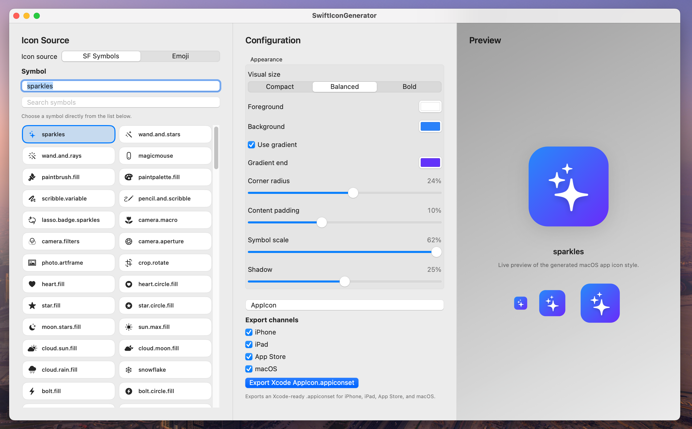

# SwiftIconGenerator

由 GPT-5.4 (OpenCode) Vibe Coding 而成。

[English README](./README.md)

## 预览



SwiftIconGenerator 是一个基于 macOS SwiftUI 的图标生成工具，可以将 `SF Symbols` 或 `Emoji` 生成为可直接用于 Xcode 的 `AppIcon.appiconset`。

它适合快速生成风格统一、可直接拖入 `Assets.xcassets` 的应用图标资源。

## 功能

- 支持使用 `SF Symbols` 生成图标
- 支持使用 `Emoji` 生成图标
- 内置可搜索的 SF Symbols 列表
- 内置常用 emoji 快速选择
- 支持打开 macOS 系统 Emoji 选择器
- 支持多尺寸实时预览
- 可调整以下外观参数：
  - 前景色
  - 背景色
  - 渐变
  - 圆角
  - 内容留白
  - 图标缩放
  - 阴影
- 提供视觉大小预设：`Compact`、`Balanced`、`Bold`
- 支持自定义导出的 `.appiconset` 名称
- 支持按平台筛选导出：
  - iPhone
  - iPad
  - App Store
  - macOS

## 导出结果

应用会导出完整的、兼容 Xcode 的 `AppIcon.appiconset`，并自动生成 `Contents.json`。

示例文件：

- `appicon-iphone-60@2x.png`
- `appicon-iphone-60@3x.png`
- `appicon-ipad-76@1x.png`
- `appicon-ipad-76@2x.png`
- `appicon-ipad-83.5@2x.png`
- `appicon-appstore-1024.png`
- `appicon-mac-16@1x.png`
- `appicon-mac-16@2x.png`
- `appicon-mac-32@1x.png`
- `appicon-mac-32@2x.png`
- `appicon-mac-128@1x.png`
- `appicon-mac-128@2x.png`
- `appicon-mac-256@1x.png`
- `appicon-mac-256@2x.png`
- `appicon-mac-512@1x.png`
- `appicon-mac-512@2x.png`
- `Contents.json`

将导出的 `.appiconset` 整个拖进 Xcode 项目的 `Assets.xcassets` 即可。

## 运行方式

推荐方式：

1. 打开 `SwiftIconGenerator.xcodeproj`
2. 在 Xcode 中运行 `SwiftIconGenerator` scheme

当前项目已经整理为标准 macOS 应用工程，并绑定了正式应用图标。

也可以通过命令行运行：

```bash
swift run
```

## 使用流程

1. 选择 `SF Symbols` 或 `Emoji`
2. 输入或选择图标内容
3. 调整外观参数
4. 设置导出的图标组名称
5. 选择要导出的平台
6. 导出 `.appiconset`

## 项目结构

- `SwiftIconGenerator.xcodeproj`：标准 macOS Xcode 工程
- `SwiftIconGenerator/`：应用资源，例如 `Info.plist` 和 `Assets.xcassets`
- `Sources/`：SwiftUI 源码和图标渲染逻辑
- `Package.swift`：用于命令行构建的 Swift Package 定义

## 说明

- Xcode 工程是当前项目的主要运行方式。
- Swift Package 仍然保留，方便快速构建和本地调试。
- Emoji 图标通过文本绘制生成，SF Symbols 图标通过 AppKit Symbol Image 绘制生成。

## License

本项目采用 MIT License。详见 [`LICENSE`](./LICENSE)。
